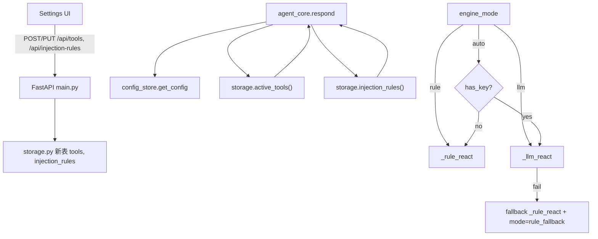
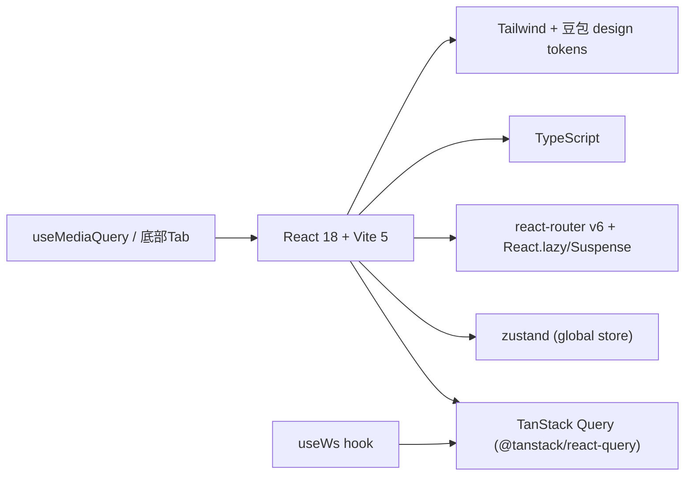

# Config Extensibility + Mobile Adaptation + Frontend Tech Upgrade

Feature Name: config-extensibility-mobile
Updated: 2026-09-23

## Description

在不破坏现有「豆包」视觉风格的前提下：
1. 后端把「工具注册表」「注入规则」改为数据驱动（DB 持久化 + 即时生效），补齐 `char_budget`/`react_steps`/`top_p` 与 `engine_mode` 的界面控件。
2. 前端全量移动端响应式（抽屉 + 底部 Tab + 单列堆叠）。
3. 前端引入 2026 主流技术：TanStack Query、zustand、Tailwind、React.lazy 路由分割、React.memo、TypeScript。

## Architecture

### 后端：数据驱动工具/护栏

- 新增两张表（`CREATE TABLE IF NOT EXISTS`，幂等，随 `_ensure_schema` 自愈）：
  - `tools(id TEXT PRIMARY KEY, name TEXT, desc TEXT, args_json TEXT, enabled INTEGER, builtin INTEGER, updated_at TEXT)`
  - `injection_rules(id INTEGER PK AUTOINCREMENT, expr TEXT, action TEXT CHECK(action IN ('block','log_only')), enabled INTEGER, created_at TEXT)`
- 内置三工具与 7 条默认注入规则在首次初始化时以 `builtin=1`/兜底写入，保证「全删仍可运行」。
- `agent_core.respond` 不再硬编码 `tools` dict，改为：
  - `cfg["tools"]` 开关 + `storage.active_tools()`（DB 覆盖）合并出可用工具集。
  - 内置实现映射表 `_BUILTIN_TOOL_IMPL = {query_order: fn, initiate_refund: fn, lookup_policy: fn}`；非内置工具若 `args_json` 含 `kind:"kb_search"` 则复用 `retrieve`，否则返回「暂不支持」占位结果（本次不接真实外部 API，见 Out of Scope）。
  - 注入检测：`storage.injection_rules(enabled=1)` 动态编译；全部停用时回退内置 7 条默认模式。

### 前端：技术栈

- **Provider 层**：`main.jsx` 包裹 `QueryClientProvider` + 路由。`QueryClient` 设 `staleTime`、`refetchOnWindowFocus`。
- **zustand store** `useAppStore`：`{sessionId, visitorId, opId, config, setSession, hydrate}`，各页 selector 订阅。`config` 与 TanStack Query 的 config query 共享，保存后 `queryClient.invalidateQueries(['config'])`。
- **hooks**：
  - `useQueryKeys`：`['config']`、`['kb']`、`['admin','overview']`、`['admin','memory']`、`['admin','injection']`、`['tools']`、`['injection-rules']`。
  - `useMutation`：save config / kb / tools / injection-rules，onSuccess 失效对应 query。
  - `useWs(url, onMsg)`：封装 WebSocket 自动重连（替代 VisitorChat/OperatorDesk 各自手写重连）。
- **响应式**：`useMediaQuery(query)` 基于 `matchMedia`；<640px 渲染 `MobileShell`（底部 Tab + 侧滑抽屉 + `body` 滚动锁），≥640px 渲染 `DesktopShell`。输入区在移动端用 `position: sticky; bottom: 0` 并监听 `visualViewport` 避免键盘遮挡。
- **代码分割**：`main.tsx` 用 `React.lazy(() => import('./pages/VisitorChat'))` 等，`<Suspense fallback={<Spinner/>}>` 包裹。
- **性能**：消息行 `MessageRow = React.memo(...)`；长列表（记忆/注入日志）用 `useMemo` 切片 + 受控分页，避免全量重渲染。
- **Tailwind**：`tailwind.config.ts` 把豆包 token 映射为主题色（`brand`、`brand-grad`、`r-md`、`shadow-md`），新页面全用原子类；旧 `styles.css/pages.css/pages2.css` 保留为 token 与过渡，逐步替换。

## Components and Interfaces

### 后端新增/修改

- `backend/storage.py`：`_ensure_schema` 增 `tools`、`injection_rules` 表；新增 `active_tools()`、`upsert_tool(id,name,desc,args_json,enabled,builtin)`、`delete_tool(id)`、`injection_rules(enabled_only=True)`、`add_injection_rule(expr,action)`、`update_injection_rule(id,expr,action,enabled)`、`delete_injection_rule(id)`、`list_tools()`。
- `backend/agent_core.py`：`_all_tools()` 改为读 DB + 内置映射；`detect_injection()` 改为读 DB 规则；`respond(query,history,visitor_id,image_b64,session_id)` 注入 `engine_mode` 分支与 `rule_fallback` 标注；`build_context()` 应用 `char_budget`。
- `backend/config_store.py`：`DEFAULTS` 增 `engine: {mode: 'auto'}`；确认 `llm.top_p`、`context.char_budget`、`escalation.react_steps` 有默认值（已有）。
- `backend/main.py`：新增端点
  - `GET /api/tools` → `{tools:[{id,name,desc,args_json,enabled,builtin}]}`
  - `POST /api/tools`（`{id,name,desc,args_json,enabled}`，400 校验 JSON/字段）
  - `PUT /api/tools/{id}`、`DELETE /api/tools/{id}`
  - `GET /api/injection-rules` → `{rules:[...]}`
  - `POST /api/injection-rules`（`{expr,action}`，正则编译校验，400）
  - `PUT /api/injection-rules/{id}`、`DELETE /api/injection-rules/{id}`
  - `PUT /api/config` 白名单增 `engine` 组。
  - `GET /api/agent/health` 增 `engine_mode` 字段。

### 前端新增/修改

- `frontend/src/lib/queryClient.ts`：`new QueryClient({ defaultOptions:{queries:{staleTime:30_000, refetchOnWindowFocus:false, retry:1}} })`。
- `frontend/src/store/appStore.ts`：zustand。
- `frontend/src/hooks/useWs.ts`、`frontend/src/hooks/useMediaQuery.ts`。
- `frontend/src/lib/queries.ts`：所有 query key + `useXxx`/`mutateXxx`。
- `frontend/src/components/shells/MobileShell.tsx`、`DesktopShell.tsx`、`BottomTab.tsx`、`SlideDrawer.tsx`、`Spinner.tsx`。
- `frontend/src/components/ui/*`：把 `ui.jsx` 拆为 TSX 组件 + `React.memo`，新增 `ToolEditorDrawer`、`InjectionRuleList`、`ModeSwitch`、`RangeRow`。
- `frontend/src/pages/Settings.tsx`：新增「工具注册表」「注入规则」「引擎模式」三个分组。
- `tailwind.config.ts`、`tsconfig.json`、`postcss.config.js`。
- `index.html`：保持 favicon/标题。

## Data Models

### tools 表
| 列 | 类型 | 说明 |
|---|---|---|
| id | TEXT PK | 工具唯一标识（如 `query_order`） |
| name | TEXT | 展示名 |
| desc | TEXT | LLM 用描述 |
| args_json | TEXT | JSON schema（参数名→类型） |
| enabled | INTEGER | 1/0 |
| builtin | INTEGER | 内置标志 |
| updated_at | TEXT | ISO |

### injection_rules 表
| 列 | 类型 | 说明 |
|---|---|---|
| id | INTEGER PK | 自增 |
| expr | TEXT | 正则/关键词 |
| action | TEXT | `block` / `log_only` |
| enabled | INTEGER | 1/0 |
| created_at | TEXT | ISO |

### engine_mode
`cfg["engine"]["mode"] ∈ {"rule","llm","auto"}`，默认 `auto`。

## Correctness Properties

- 内置工具与内置注入规则在删除/停用后仍可由兜底机制保证 Agent 不崩溃（Req 1.4 / Req 2.5）。
- 工具/规则修改即时生效：`respond` 每轮从 DB 重读，无缓存（对齐现有 `config` 即时生效模式）。
- `engine_mode=rule` 时不依赖 LLM Key；`=llm` 无 Key 返回 503；LLM 失败降级 `rule_fallback`。
- 响应式：`matchMedia('(max-width:639px)')` 驱动 MobileShell；`prefers-reduced-motion` 时关闭抽屉滑入动画。
- 类型安全：所有 API 响应有 TS interface，构建 `tsc --noEmit` 通过。

## Error Handling

- 后端：JSON schema 非法 → 400 + `{detail:"args_json 不是合法 JSON"}`；正则编译失败 → 400 + 具体错误；删内置工具仅标记 `enabled=0`（保留 builtin 行兜底）。
- 前端：TanStack Query 失败 → 页面顶部 `ErrorBanner` + 重试按钮；mutation 失败 toast；WS 断线自动重连（指数退避 1s→2s→4s，上限 8s）。
- 移动端：`visualViewport` 监听键盘高度，输入区上移；抽屉打开时锁 `body` 滚动。

## Test Strategy

- 后端单测 `backend/test_agent.py` 扩：
  - 工具注册表 CRUD + 动态加载（删内置后 ReAct 仍跑）。
  - 注入规则 CRUD + block/log_only 行为 + 全停用回退内置。
  - `engine_mode` 三态 + `llm` 无 Key 503 + LLM 失败降级 `rule_fallback`。
  - `char_budget`/`react_steps` 生效断言。
- 前端：`vite build`（含 `tsc`）0 错误；手工 e2e：桌面/移动断点（DevTools 模拟器）走通对话、坐席接管、设置保存、工具/规则增删改。

## References

[^1]: backend/agent_core.py#L107-L112 — 当前硬编码工具注册
[^2]: backend/agent_core.py#L137-L151 — 当前硬编码注入模式
[^3]: backend/config_store.py#L28-L42 — context 参数
[^4]: frontend/src/main.jsx — 当前路由（无懒加载）
[^5]: frontend/src/pages.css#L370-L374 — 当前唯一响应式断点
